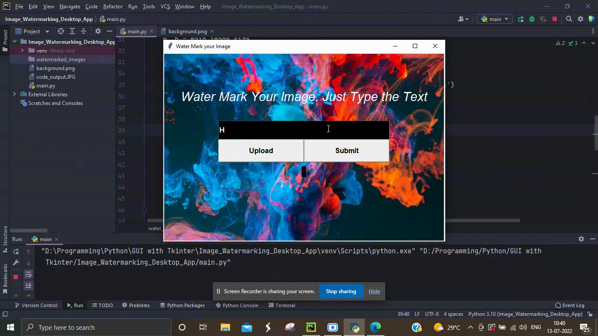

# Image_Watermarking_Desktop_App
A python program to water mark any image and save it.

  

  <h1> Program Flowchart </h1>
  

<h1> Guide to Build this Project </h1>

<h2> Step 1: Setting up Screen </h2>

  Import tkinter library and create a window object using <em>Tk()</em>. Then call <em>mainloop()</em> method to keep the window on unless closed by the user.

<h2> Step 2: Setting up Widgets </h2>

  We use the canvas widget to create a background. We first setup its size equal to the image dimensions. Create a usable image using <em> PhotoImage() </em>. 
  Then we use <em> create_image </em> and <em> create_text </em> to display an image and text for good UI. 
  We create an input field and two buttons for uploading image and submit button. We use <em> grid </em> layout to display our widgets in a systematic matter.

<h2> Step 3: Defining Methods of Buttons </h2>

  We first define method for <em> Upload </em> button. We use <em>filedialog.askopenfilename</em> method of tkinter to open a dialogue box to ask user to uplaod file.
  Then we save its name and display the name on the screen and make <em> Upload </em> button text green to show the file as uploaded. 
  The uploaded file path is saved in a global variable passed to method of submit button.  

<h2> Step 4: Watermarking the Image and Saving it </h2>

  We need the pillow library to watermark our image. Pillow is library for <em>Image Processing</em>. 
  We use three objects from it, <em>Image, ImageDraw, and ImageFont.</em> 
  We create a new image with same dimensions as older one, write a piece of text on it with defined color code. Then we save it and show it to user.
  After that we reset the widgets to make them look ready to take another input.

